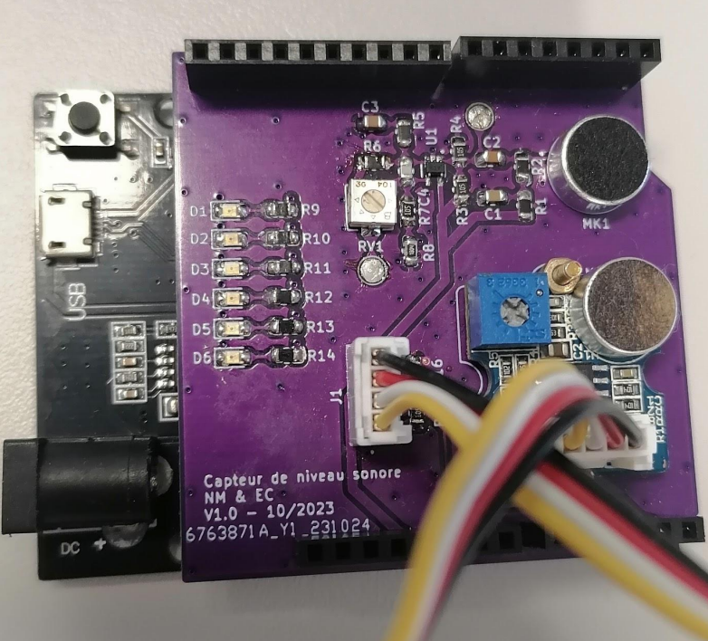

# Détecteur de niveau sonore

Le but de ce projet est de concevoir un détecteur de niveau sonore. Il permet de mesurer en dB(A) le niveau sonore moyen de l'environnement, et d'en afficher la valeur, sur l'interface graphique en ligne Grafana via Wi-Fi, et via un niveau de LEDs de couleurs (vert, orange, rouge). Un microphone à condensateur électret a été utilisé, et le conditionnement du signal analogique (amplification et filtrage), ainsi que l'étalonnage de ce dernier ont été effectués. Le tout a été réalisé sous forme de carte électronique au format shield pour ESP32. Un emplacement pour un microphone Grove a été laissé sur la carte. Le détail de tout le projet est présenté dans le rapport fourni.

